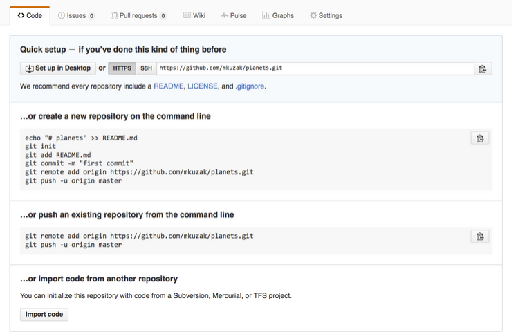
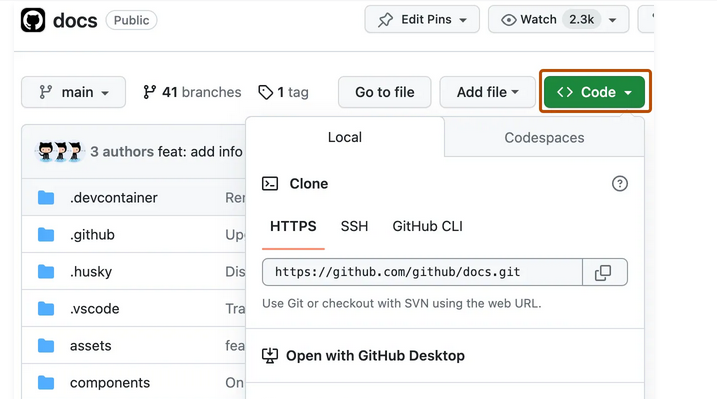
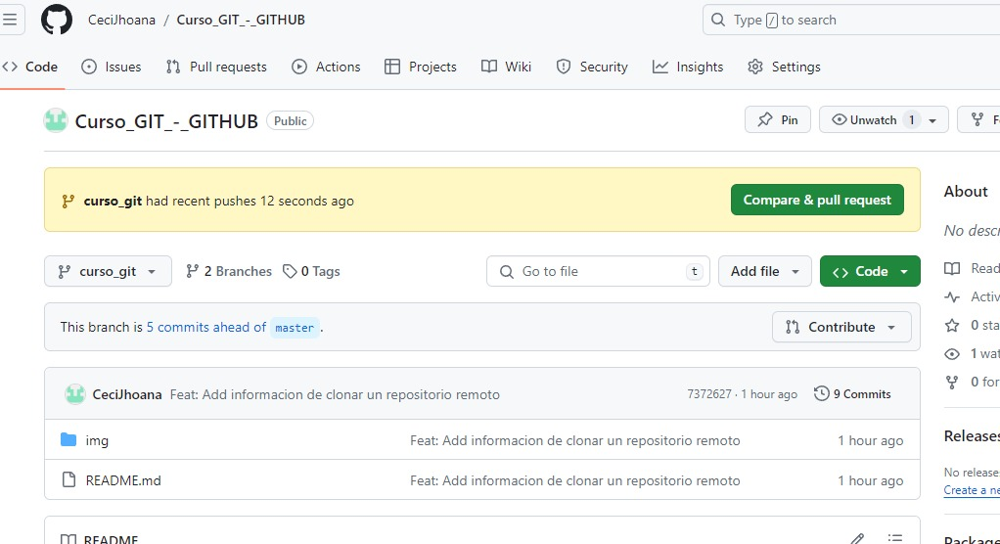
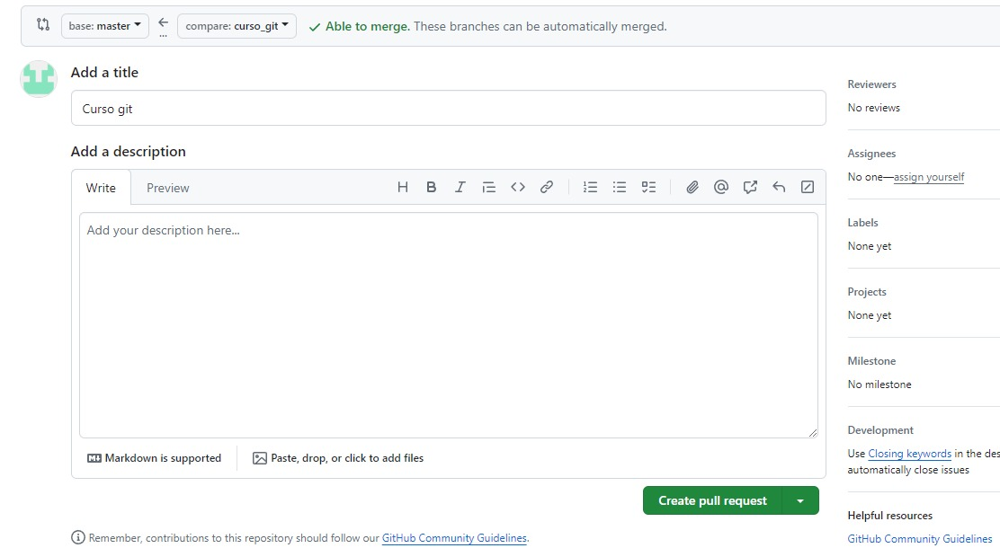
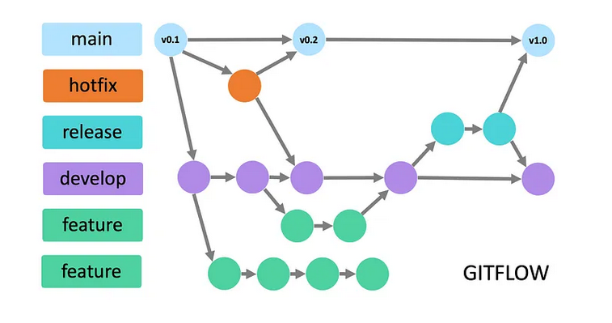
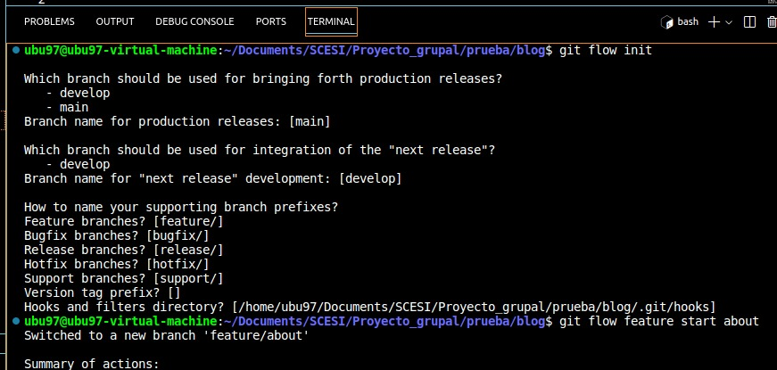

# CURSO GIT & GITHUB
## Descripción del curso
Este documento contiene mis notas del curso de Git y GitHub. Está diseñado para proporcionar una referencia rápida y un repaso a los conceptos clave de Git, así como las prácticas comunes para usar GitHub efectivamente en proyectos de desarrollo de software.
## Índice
1. [Introducción a Git](#introducción-a-git)
2. [States y Commits](#states-y-commits)
3. [Ramas, Merge y Conflictos](#ramas-merge-y-conflictos)
4. [GitHub](#github)
5. [Push, Pull y Pull Requests](#push-pull-y-pull-requests)
6. [Git Flow](#git-flow)
7. [Buenas Prácticas en Git](#buenas-prácticas-en-git)
8. [Deshacer Cambios](#deshacer-cambios)
9. [Hooks, Alias y Trucos de Git](#hooks-alias-y-trucos-de-git)

## Introducción a GIT
### ¿Qué es GIT?
Git es un un sistema distribuido de control de versiones, gratuito y de código abierto
bajo licencia GPLv2. Fue diseñado originalmente por Linus Torvalds12, el creador de
Linux.
* Git, al ser un sistema distribuido, aloja una copia completa del repositorio en cada máquina local que está trabajando en el código. Además, puedes tener uno o varios repositorios remotos para
sincronizarlos


### Instalación de GIT
**Linux (Debian/Ubuntu)**
* Abre una terminal.
* Actualiza tu paquete de gestión
* Instala GIT
* Verificar instalación

    ```bash
    sudo apt update
    sudo apt install git
    git --version
    ``````
**En Windows**

1. Descarga el instalador de Git desde [git-scm.com](https://git-scm.com/).
2. Ejecuta el archivo descargado y sigue las instrucciones en pantalla. Es recomendable dejar las opciones por defecto.
3. Una vez instalado, puedes acceder a Git desde el Git Bash o la línea de comandos.

**En macOS**

1. Instala Homebrew si aún no lo tienes, ejecutando:

         /bin/bash -c "$(curl -fsSL https://raw.githubusercontent.com/Homebrew/install/master/install.sh)" 
2. Una vez que Homebrew está instalado, instala Git con:

          brew install git  

3. Verifica la instalación con:
                
         git --version

### Configuración de GIT
Una vez instalado Git, debes configurarlo con tu nombre y correo electrónico. Esta información se utilizará en los commits que realices.

1. Configura tu nombre:

         git config --global user.name "Tu Nombre"

2. Configura tu correo electrónico:

        git config --global user.email "tuemail@example.com" 
**Nota:** El correo debe ser el mismo que usaras para la cuenta de GitHub.

### Otras configuraciones útiles
* Establecer el editor por defecto para Git (por ejemplo, Nano, Atom, o VS Code):
    ```bash
    git config --global core.editor "nano"
    git config --global core.editor "code"
    git config --global core.editor "atom"
    ```

* Ver todas las configuraciones de Git:

        git config --list

* Ayuda adicional y más opciones de configuración: 

        git config --help 

### Iniciar un nuevo proyecto en GIT
Hay dos manera o dos situaciones en las que quieras inicializar un proyecto en GIT:

**Primero:** Crear un proyecto desde cero (Es decir, crear un repositorio
local).

        git init nuevo-proyecto 
        cd nuevo-proyecto

Esto creará una carpeta configurada y vacía con el nombre que le has indicado.

**Segundo:** Iniciar un repositorio de una carpeta ya existente.

     cd directorio del proyecto que ya existe
     git init

*A partir de aquí ya tienes tu repositorio inicializado. Eso sí, sólo de forma local.*

## states y commits
### Los tres estados de git
* **Modificado (Modified)**
    El estado modificado indica que has cambiado un archivo pero aún no lo has guardado en tu base de datos de Git.
* **Preparado (Staged)**
    Cuando los cambios en los archivos están listos para ser comprometidos, los mueves al estado preparado. Al hacer esto, estás informando a Git que has finalizado las modificaciones en los archivos actuales y que están listos para ser consolidados en un commit. 
* **Consolidado (Committed)**
    Una vez que los cambios están preparados, los puedes consolidar. El estado consolidado significa que los datos están almacenados de manera segura en tu base de datos local de Git.
    

### Usando git status
**git status:** Ayuda a entender en qué estado se encuentran tus archivos y te guía sobre qué acciones puedes realizar a continuación.  
Ejemplo:

Tenemos un archivo nuevo llamado ejemplo.txt y otro archivo existente antiguo.txt que hemos modificado. Si ejecutamos 

        git status

Ocurre esto:

        On branch master
        Changes to be committed:
        (use "git reset HEAD <file>..." to unstage)

        modified:   antiguo.txt

        Changes not staged for commit:
        (use "git add <file>..." to update what will be committed)
        (use "git checkout -- <file>..." to discard changes in working directory)

        modified:   antiguo.txt

        Untracked files:
        (use "git add <file>..." to include in what will be committed)

        ejemplo.txt

## ¿Qué hace un **git commit**?
Un "commit" en Git esencialmente captura una instantánea de los proyectos que están en tu "staging area" (área de preparación) en ese >momento, proporcionando un punto de referencia clara en la historia de tu proyecto que puedes volver a visitar y comparar o restaurar más tarde.
### ¿Còmo realizar un Commit?
1. Abrir terminal
2. Navegar hasta el proyecto

        cd ruta/al/proyecto

3. Verificar los cambios

         git status

4. Seleccionar archivos para el commit es decir añadir los archivos al área de staging


         git add nombre_del_archivo.ext 

O añadir todos los archivos modificados: 

         git add . 

5. Crear el commit 

        git commit -m "Descripción clara y concisa de los cambios realizados"

*Esto en caso de añadir directamente el mensaje sin abrir el editor. lo cual resulta lo mas sencillo y comodo de realizar un commit*

6. Revizar el historial de los commits 

        git log

## Ramas, Merge y conflictos

### ¿Qué es una rama y para qué sirve?

Una rama en Git es como una línea separada de desarrollo dentro de un proyecto de software. Por lo que cuando estamos trabajando en una función nueva para una aplicación: en lugar de hacer esos cambios directamente en la versión principal de la aplicación, creas una nueva "rama" donde se pueden hacer los cambios de forma segura sin afectar el trabajo principal. 
* Esto permite experimentar y trabajar en múltiples características al mismo tiempo como también colaborar con otros desarrolladores de manera más organizada. 
* Una vez que los cambios están listos y probados, se podrá fusionar esa rama de vuelta a la rama principal para incorporar las mejoras al proyecto principal.


### Pasos para crear una Rama en GIT
* Paso1: Abre tu terminal o línea de comandos en la carpeta de tu repositorio Git.
* Paso2: Asegúrate de estar en la rama principal ejecutando el comando 

        git branch. 

Esto mostrará todas las ramas y resaltará en cuál estás actualmente.


* Paso3: Crear la rama con el comando:

        git branch nombre_de_nueva_rama

* Paso4: Cambiar de rama

        git switch nombre_de_nueva_rama

*¡Listo! Ahora estamos en la nueva rama y podemos comenzar a trabajar en ella. Puedemos verificarlo ejecutando **git branch** nuevamente y verás un asterisco (*) al lado de la rama en la que estás actualmente.*


### ¿Qué es un Merge?

Un merge en Git es la acción de combinar los cambios de una rama con otra rama, generalmente la rama principal del proyecto. 

* Esto se hace para integrar el trabajo realizado en una rama de desarrollo con el resto del código, permitiendo que los cambios se fusionen de manera ordenada y sin conflictos en el proyecto principal.

**Ventaja**
 Es útil porque permite a los equipos trabajar en paralelo en diferentes aspectos del proyecto y luego unir sus contribuciones de manera controlada, manteniendo un historial de cambios claro y facilitando la colaboración entre desarrolladores.


### ¿Cómo realizar un merge?

* Paso1: Asegurarse de estar en la rama que queremos fucionar los cambios. 

Es decir, si de nuestra rama local **"rama1"** queremos funionar a la rama principal **"main"**, debemos encontrarnos en la rama **main**.

* Pas2: Fusionar los cambios:

        git merge rama1

* Paso3: Git intentará fusionar los cambios automáticamente.

        Si (conflicto):
                 Resolver conflicto()
        Si no:
                Los cambios de la otra rama se fusionarán en la rama actual y podrás continuar trabajando en ella.


### ¿Qué es un conflicto en Git y cómo resolver?

Un conflicto en Git ocurre cuando dos cambios diferentes se realizan en las mismas líneas de un archivo en diferentes ramas. 

Esto puede suceder al fusionar ramas con cambios conflictivos. Git no puede determinar automáticamente cuál cambio debería prevalecer, por lo que te pide que resuelvas manualmente estos conflictos. 


### Resolver conflicto()

* Localizar el archivo que tiene conflictos. Git nos mostrará los conflictos entre 

        <<<<<<< HEAD, que marca el comienzo de tus cambios actuales, 
        =======, que separa tus cambios de los de la otra rama, 
        y >>>>>>>, que marca el final de los cambios de la otra rama.

* Decidir qué cambios quieres conservar. Edita el archivo para eliminar las marcas de conflicto y dejar solo el contenido que deseas mantener.

* Guardar los cambios realizados en el archivo.

* Después de resolver todos los conflictos, añade los archivos modificados con 

        git add nombre_del_archivo_conflicto.

* Hacer un commit con   

        git commit -m "Mensaje de commit". 
Esto finaliza la fusión y resuelve el conflicto.

### ¿Cómo eliminar una rama?

* Paso1: Estar en una rama diferente a la que deseamos eliminar
* Paso2: Eliminar
        
        git branch -d nombre_rama_a_eliminar
* Si la rama que intentamos eliminar tiene cambios que aún no han sido fusionados, Git nos advertirá y no eliminará la rama. 
**En ese caso**

        git branch -D nombre_rama_a_eliminar

## GITHUB

GitHub es una plataforma en línea donde los desarrolladores pueden almacenar y compartir su código de manera colaborativa.

**Ventajas**

 1.Permite a los equipos de programadores trabajar juntos en proyectos de software.
 
 2.Gestionar versiones de código. 
 
 3.Realizar seguimiento de problemas. 
 
 4.Coordinar el trabajo mediante herramientas como solicitudes de extracción y control de versiones utilizando Git.

 

 ### ¿Son Git y GitHub lo mismo?
 No, Git y GitHub no son lo mismo. Git es un sistema de control de versiones distribuido, mientras que GitHub es una plataforma en línea que utiliza Git para alojar repositorios de código.


### ¿Qué es un repositorio remoto?

Un repositorio remoto es una versión de tu proyecto de software alojada en un servidor en línea, 

### Creando un repositorio remoto en GitHub
1. Accede a [GitHub.com](https://github.com/) en un navegador y haz clic en el + de la parte superior derecha de la pantalla para crear un nuevo repositorio.


2. Elige un nombre para tu repositorio. No tiene por qué ser el mismo nombre que la carpeta del proyecto.

3.Se te presentarán opciones, pero no necesitas cambiar ninguna de las predeterminadas. Desplázate hacia abajo y pulsa el botón Create Repository.


*Listo ya tienes un repositorio remoto en GitHub*

Tan pronto es creado el repositorio, GitHub muestra una página con una URL y algo de información sobre cómo configurar tu repositorio local.




Una vez creado el repositorio remoto, inicialmente se encuentra vacío, en otras palabras, sin archivos y sin carpetas, por lo que se copiará la primera línea de comando proporcionada por el propio GitHub.
Éste comando permitirá crear una dirección del repositorio remoto en la máquina local, siendo ejecutado a través del terminal y tendrá la siguiente estructura :

        $ git remote add origin git@github.com:TuUsuarioDeGitHub/NombreRepositorio.git

*Por lo que ya podremos vincular el repositorio local con el repositorio remoto*

### ¿Cómo clonar un repositorio remoto creado previamente?

1. Dirigirse al repositorio remoto y copiar su dirección ya sea la dirección HTTPS o SSH
<pre>Dato curioso:
Una dirección HTTPS es un enlace seguro que utiliza el protocolo de transferencia de hipertexto seguro para acceder a recursos en línea, como sitios web o repositorios de código en GitHub. 

SSH (Secure Shell) es un protocolo de red que permite a los usuarios acceder de forma segura a una computadora remota y realizar operaciones de forma segura, como el acceso a repositorios de código en GitHub. 

La diferencia principal está en la forma en que se autentica la conexión: HTTPS utiliza certificados SSL/TLS para autenticar, mientras que SSH utiliza claves de acceso para la autenticación. SSH tiende a ser más seguro y eficiente para el trabajo con repositorios de código.</pre>



2. Ya teniendo la dirección url del repositorio remoto, nos dirigimos a nuestra terminal o linea de comando y utilizar el comando:

                git clone URL_del_repositorio_remoto

3. Al presionar Enter. Git descargará una copia del repositorio remoto en tu computadora y configurará automáticamente un vínculo entre tu repositorio local y el repositorio remoto.

## Push, Pull y Pull Requests

### ¿Qué es un Push?
Un "push" en Git es el acto de enviar tus cambios locales a un repositorio remoto. Esto actualiza el estado del repositorio remoto con tus cambios locales. 

**Para ejecutar un "push", sigue estos pasos:**

* Paso1: Asegúrase de haber realizado y guardado los cambios que deseas enviar al repositorio remoto.

* Paso2: Abrir la terminal o línea de comandos.

* Paso3: Utilizar el comando git push seguido del nombre del repositorio remoto y la rama que deseas enviar.

         git push nombre_del_repositorio_remoto nombre_de_la_rama

  Si queremos establecer una conexión entre la rama local y la rama remota utilizaremos:

         git push --set-upstream nombre_de_la_rama  

  Esto nos ayudarà que para el pròximo push solo tengamos que poner el comando git push sin la necesidad de especificar que rama ya que están conecctados.
         git push

*Listo si presionamos Enter. Git enviará tus cambios locales al repositorio remoto especificado.*
### Experimentos con git push
* Establecer la conexión entre la rama local y la rama remota de forma predeterminada -u o --set-upstream:

         git push -u origin nombre_de_la_rama

* Para enviar todas las ramas locales que tengan una rama remota asociada en el repositorio remoto.
        
        git push --all

*Para **forzar** el envío de cambios locales al repositorio remoto, sobrescribiendo cualquier historial existente en la rama remota con el historial de la rama local.

         git push --force
         git push -f

Es una operación potencialmente peligrosa, ya que puede causar la pérdida de cambios si no se utiliza con precaución.

* Para **eliminar** una rama remota en el repositorio remoto "origin".

        git push -d origin nombre_rama

 *Es importante tener en cuenta que este comando no elimina la rama local correspondiente en tu máquina, solo elimina la rama remota en el repositorio remoto.*
### ¿Qué es git pull?
El comando git pull se utiliza para recuperar los cambios del repositorio remoto y fusionarlos automáticamente con tu rama local.

         git pull

### Experimentos con git pull

* Para recuperar los cambios de la rama remota llamada main en el repositorio remoto y fusionarlos automáticamente con tu rama local actual. 

        git pull origin main

* Para traer los cambios hacia todas las ramas existentes

        git pull --all

* Para establecer una relación entre una rama local y una rama remota

        git pull --set-upstream origin nombre_de_rama

Esto significa que cuando hagas un git pull en la rama local nombre_de_rama, Git sabrá que debe recuperar los cambios de la rama remota origin/nombre_de_rama.

* Para traer varias rama hacia una sola indicando que ramas queremos traerlas
        
        git pull origin rama1 rama2 ramaN

### ¿Qu+e es una Pull Request?

Una pull request o PR es una solicitud que un colaborador o miembro del equipo hace a los propietarios o compañeros del equipo de un repositorio en Git para que revisen y consideren los cambios realizados en una rama de código específica.

*Las pull requests proporcionan un espacio para revisar el código, realizar pruebas y comentarios antes de fusionar los cambios, lo que ayuda a mantener la calidad del código y facilita la colaboración entre los miembros del equipo.*

### ¿Cómo hacer una pull request?

Una vez que envíe los cambios al repositorio, el botón Comparar y solicitar extracción aparecerá en GitHub.



Click it and you'll be taken to this screen:



Abra una solicitud de extracción haciendo clic en el botón Create pull request . Esto permite a los colaboradores del repositorio revisar su contribución. Desde aquí, pueden fusionarlo si está bien, o pueden pedirle que haga algunos cambios.

### ¿Cómo hacer una buena Pull Request?

* Hacer pull request con commit pequeños ya que nos permite una mejor revisión entre todo el equipo.

* Realizar una buena descripción de la pull request: podemos usar imagenes si es posible o pasos para poder ejecutar la nueva funcionalida que esta intentado fucionar.

## Git Flow

### ¿Qué es Git Flow?

Git Flow es un modelo de flujo de trabajo para Git que proporciona un conjunto de reglas y convenciones para organizar y gestionar el desarrollo de software de manera estructurada.

* Este modelo se basa en el concepto de tener ramas específicas para diferentes tipos de cambios y fases del desarrollo de software. 

**Componentes principales de Git FLow**

**Rama master:** Representa la rama principal del proyecto.

**Rama develop:** Es la rama de integración principal donde se fusionan todas las características completadas.

**Ramas de características (feature branches):** Se crean a partir de la rama develop y se utilizan para desarrollar nuevas características o funcionalidades. 

**Ramas de publicación (release branches):** Se crean a partir de la rama develop y se utilizan para preparar una nueva versión para el lanzamiento. 

**Ramas de hotfix (hotfix branches):** Se utilizan para corregir errores críticos en producción. Se crean a partir de la rama master.



## ¿Cómo inicializar git flow?

Para inicializar poner:

Debemos instalar git flow

**Linux**

        apt-get install git-flow

**Windows**

        wget -q -O - --no-check-certificate https://github.com/nvie/gitflow/raw/develop/contrib/gitflow-installer.sh | bash

Inicializar git flow con:

        git flow init
Te aparecerá una serie de opciones por las cuales tienes que aceptar todas:



Para añadir una rama remota con git flow:

        git flow feature start nombre_de_la_feature

*Ya podremos inicializar nuestro flujo de trabajo*

## Buenas Prácticas en Git

### ¿Con què frecuencia deberìa realizar un Commit?
Realizar commits pequeños realizando funcionalidades pequeñas
Esto no significa realizar commits sin sentido, como solo borrar un espacio y hacer commit.
### ¿Cómo escribir Buenos commits?
Usar hasta 50 caracteres como máximo para un mensaje de commit

Por lo que las siguientes palabras nos ayudarán a redactar mejor los mensajes:

* Add: Significa que se añade un nuevo archivo.

* Change: Significa que se modifica un archivo existente.

* Fix: Significa que se arregla un bug.

* Remove: Significa que se elimina un archivo existente.

### Escribir buenos nombres para las ramas

Usar el nombre de la acción que se realiza en la rama como:

* bug: Cambios de código para arreglar un bug conocido.

*feature: Desarrollo de una nueva característica.

*experiment: Experimentos que nunca serán fusionados.

* hotfix: Cambio rápido de un error crítico.

Ejemplo: 
        
        feature/blog
        feature/about


## Deshacer Cambios

### ¿En qué momentos deshacemos cambios?

* Cuando el proyecto ya no funciona y queremos volver a un estado sin conflictos y empezr de nuevo.
* Cuando queremos recuperar una parte del codigo anteriormente modificado
* O cuando queremos recuperar archivos eliminados

### Comandos destructivos y no destructivos

 **¿Qué es un comando destructivo y qué es un comando no destructivo en GI?**

 * Un comando destructivo es aquel que puede alterar o eliminar permanentemente el historial de cambios o datos en el repositorio. 
 * un comando no destructivo es aquel que no altera ni elimina permanentemente el historial de cambios o datos en el repositorio.

### Comandos destructivos

 ### Git Reset
 se utiliza para mover la punta de una rama a un commit específico, lo que puede tener diferentes efectos según la opción que se le pase.

* **Es el reset más destructivo.** Mueve la punta de la rama al commit especificado y deshace todos los cambios en el área de preparación (staging) y en el directorio de trabajo. Todos los cambios no confirmados se eliminarán permanentemente.

        git reset --hard id_commit

* Mueve la punta de la rama al commit especificado, pero mantiene los cambios en el área de preparación (staging). Esto significa que los cambios de los archivos no se verán afectados y seguirán estando preparados para ser confirmados nuevamente.

        git reset --soft id_commit

### Comandos no destructivos

### Git Revert

Se utiliza para deshacer un commit específico creando un nuevo commit que revierte los cambios introducidos por el commit que deseamos deshacer. 

**Ventaja**

El uso de git revert es útil cuando deseas deshacer un commit específico sin eliminar la historia de cambios y sin afectar a otros colaboradores del repositorio que puedan haber basado su trabajo en los cambios que deseas deshacer.

Comando:
* Se utiliza cuando deseas deshacer un commit específico mientras mantienes un historial de cambios coherente.

         git revert id_commit

* Forma conveniente de revertir el commit más reciente en tu rama actual. 

         git revert HEAD
         git revert HEAD~9

El comando git revert HEAD~9 es una forma de revertir el noveno commit anterior al commit actual en tu rama. 
        
### Git Checkout

* Se utiliza para hacer cambios en los archivos

        git checkout -- nombre_de_archivo

* Deshacer cambios en archivos específicos de un commit anterior

        git checkout identificador_del_commit -- nombre_de_archivo

* Permitiendonos recuperar codigo de commits especificos

         git checkout identificador_del_commit


## Hooks, Alias y tru


