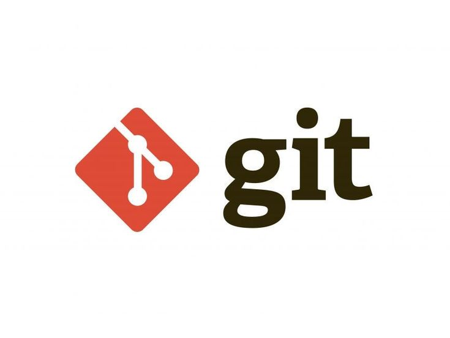

# CURSO GIT & GITHUB
## Descripción del curso
    Este documento contiene mis notas del curso de Git y GitHub. Está diseñado para proporcionar una referencia rápida y un repaso a los conceptos clave de Git, así como las prácticas comunes para usar GitHub efectivamente en proyectos de desarrollo de software.
## Índice
1. [Introducción a Git](#introducción-a-git)
2. [States y Commits](#states-y-commits)
3. [Ramas, Merge y Conflictos](#ramas-merge-y-conflictos)
4. [GitHub](#github)
5. [Push, Pull y Pull Requests](#push-pull-y-pull-requests)
6. [Git Flow](#git-flow)
7. [Buenas Prácticas en Git](#buenas-prácticas-en-git)
8. [Deshacer Cambios](#deshacer-cambios)
9. [Hooks, Alias y Trucos de Git](#hooks-alias-y-trucos-de-git)

## Introducción a GIT
### ¿Qué es GIT?
    Git es un un sistema distribuido de control de versiones, gratuito y de código abierto
    bajo licencia GPLv2. Fue diseñado originalmente por Linus Torvalds12, el creador de
    Linux.
* Git, al ser un sistema distribuido, aloja una copia completa del repositorio en cada máquina local que está trabajando en el código. Además, puedes tener uno o varios repositorios remotos para
sincronizarlos



### Instalación de GIT
**Linux (Debian/Ubuntu)**
* Abre una terminal.
* Actualiza tu paquete de gestión
* Instala GIT
* Verificar instalación

    ```bash
    sudo apt update
    sudo apt install git
    git --version
    ``````
**En Windows**

1. Descarga el instalador de Git desde [git-scm.com](https://git-scm.com/).
2. Ejecuta el archivo descargado y sigue las instrucciones en pantalla. Es recomendable dejar las opciones por defecto.
3. Una vez instalado, puedes acceder a Git desde el Git Bash o la línea de comandos.

**En macOS**

1. Instala Homebrew si aún no lo tienes, ejecutando:

<pre> /bin/bash -c "$(curl -fsSL https://raw.githubusercontent.com/Homebrew/install/master/install.sh)" </pre>
2. Una vez que Homebrew está instalado, instala Git con:

<pre>brew install git</pre>

3. Verifica la instalación con:
<pre>git --version</pre>

### Configuración de GIT
Una vez instalado Git, debes configurarlo con tu nombre y correo electrónico. Esta información se utilizará en los commits que realices.

1. Configura tu nombre:
    <pre> git config --global user.name "Tu Nombre" </pre>
2. Configura tu correo electrónico:
    <pre> git config --global user.email "tuemail@example.com" </pre>
**Nota:** El correo debe ser el mismo que usaras para la cuenta de GitHub.

### Otras configuraciones útiles
* Establecer el editor por defecto para Git (por ejemplo, Nano, Atom, o VS Code):
    ```bash
    git config --global core.editor "nano"
    git config --global core.editor "code"
    git config --global core.editor "atom"
    ```

* Ver todas las configuraciones de Git:
    <pre> git config --list </pre>
* Ayuda adicional y más opciones de configuración: 
    <pre> git config --help </pre>

### Iniciar un nuevo proyecto en GIT
Hay dos manera o dos situaciones en las que quieras inicializar un proyecto en GIT:

**Primera:** Crear un proyecto desde cero (Es decir, crear un repositorio
local).
    <pre>git init nuevo-proyecto 
         cd nuevo-proyecto </pre>
Esto creará una carpeta configurada y vacía con el nombre que le has indicado.

**Segundo:** Iniciar un repositorio de una carpeta ya existente.

<pre>   cd directorio del proyecto que ya existe
   git init</pre>

*A partir de aquí ya tienes tu repositorio inicializado. Eso sí, sólo de forma local.*

## states y commits
### Los tres estados de git
* **Modificado (Modified)**
    El estado modificado indica que has cambiado un archivo pero aún no lo has guardado en tu base de datos de Git.
* **Preparado (Staged)**
    Cuando los cambios en los archivos están listos para ser comprometidos, los mueves al estado preparado. Al hacer esto, estás informando a Git que has finalizado las modificaciones en los archivos actuales y que están listos para ser consolidados en un commit. 
* **Consolidado (Committed)**
    Una vez que los cambios están preparados, los puedes consolidar. El estado consolidado significa que los datos están almacenados de manera segura en tu base de datos local de Git.
    

### Usando git status
**git status:** Ayuda a entender en qué estado se encuentran tus archivos y te guía sobre qué acciones puedes realizar a continuación.  
Ejemplo:

Tenemos un archivo nuevo llamado ejemplo.txt y otro archivo existente antiguo.txt que hemos modificado. Si ejecutamos 
<pre> git status </pre>
Ocurre esto:
<pre> 
    On branch master
    Changes to be committed:
    (use "git reset HEAD <file>..." to unstage)

    modified:   antiguo.txt

    Changes not staged for commit:
    (use "git add <file>..." to update what will be committed)
    (use "git checkout -- <file>..." to discard changes in working directory)

    modified:   antiguo.txt

    Untracked files:
    (use "git add <file>..." to include in what will be committed)

    ejemplo.txt

</pre>

## ¿Qué hace un **git commit**?
    Un "commit" en Git esencialmente captura una instantánea de los proyectos que están en tu "staging area" (área de preparación) en ese >momento, proporcionando un punto de referencia clara en la historia de tu proyecto que puedes volver a visitar y comparar o restaurar más tarde.
### ¿Còmo realizar un Commit?
1. Abrir terminal
2. Navegar hasta el proyecto
<pre>cd ruta/al/proyecto</pre>
3. Verificar los cambios
<pre>git status</pre>
4. Seleccionar archivos para el commit es decir añadir los archivos al área de staging
<pre> git add nombre_del_archivo.ext </pre>
O añadir todos los archivos modificados: 
<pre> git add . </pre>
5. Crear el commit <pre>git commit -m "Descripción clara y concisa de los cambios realizados"</pre> 
*Esto en caso de añadir directamente el mensaje sin abrir el editor. lo cual resulta lo mas sencillo y comodo de realizar un commit*

6. Revizar el historial de los commits <pre> git log </pre>


    