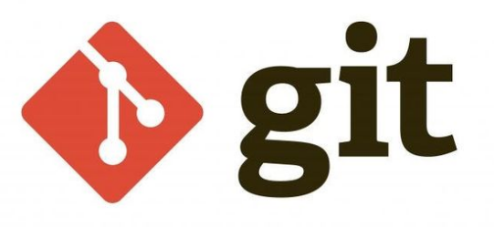
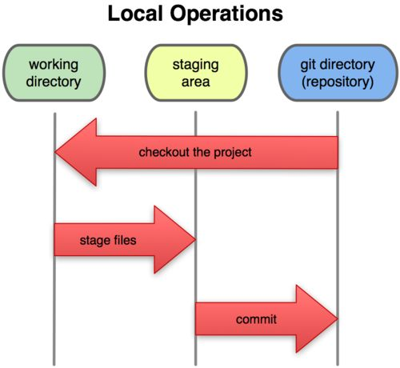
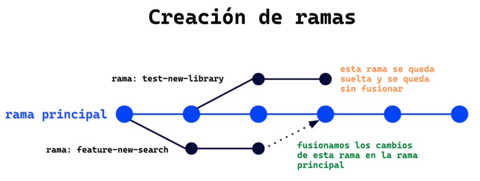
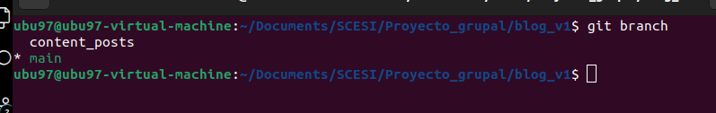
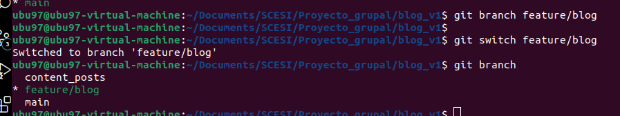
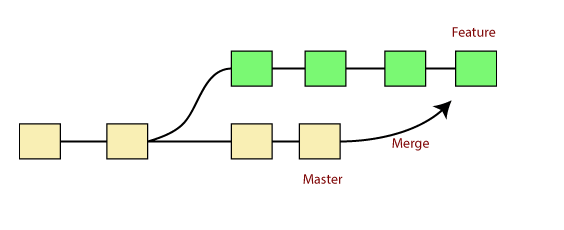
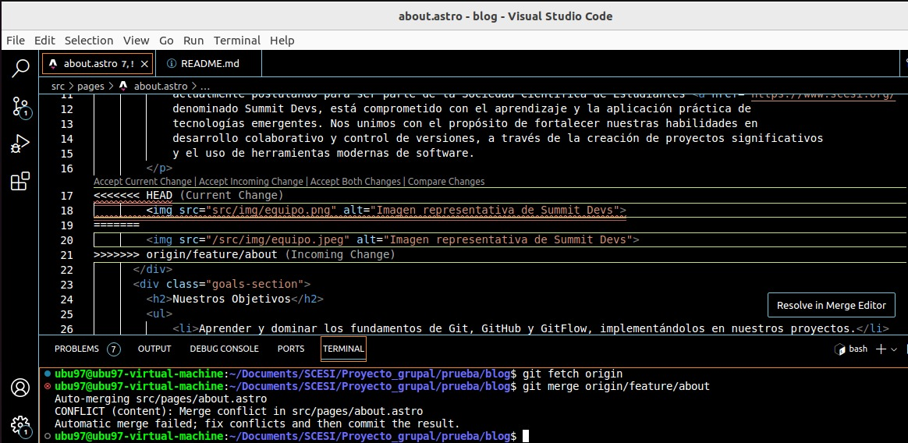
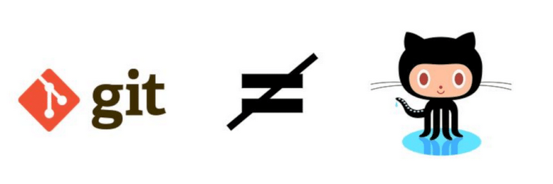
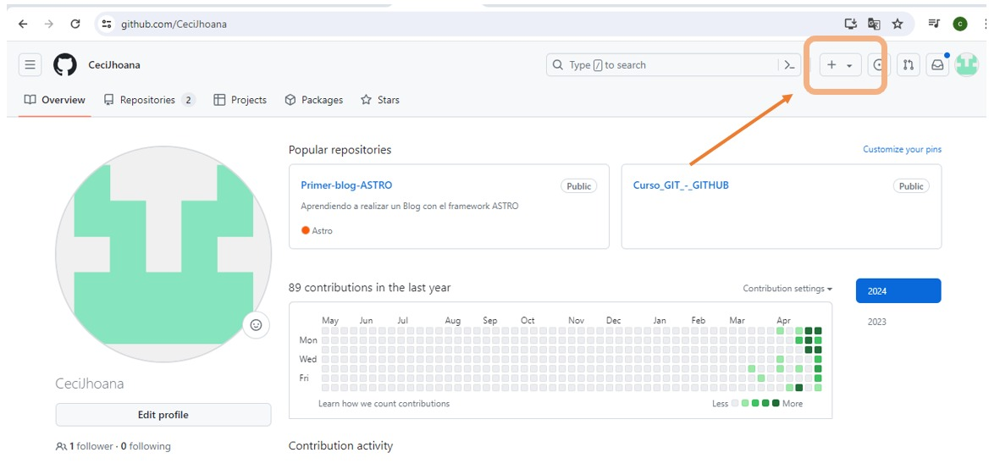
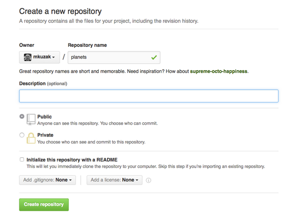

# CURSO GIT & GITHUB
## Descripción del curso
Este documento contiene mis notas del curso de Git y GitHub. Está diseñado para proporcionar una referencia rápida y un repaso a los conceptos clave de Git, así como las prácticas comunes para usar GitHub efectivamente en proyectos de desarrollo de software.
## Índice
1. [Introducción a Git](#introducción-a-git)
2. [States y Commits](#states-y-commits)
3. [Ramas, Merge y Conflictos](#ramas-merge-y-conflictos)
4. [GitHub](#github)
5. [Push, Pull y Pull Requests](#push-pull-y-pull-requests)
6. [Git Flow](#git-flow)
7. [Buenas Prácticas en Git](#buenas-prácticas-en-git)
8. [Deshacer Cambios](#deshacer-cambios)
9. [Hooks, Alias y Trucos de Git](#hooks-alias-y-trucos-de-git)

## Introducción a GIT
### ¿Qué es GIT?
Git es un un sistema distribuido de control de versiones, gratuito y de código abierto
bajo licencia GPLv2. Fue diseñado originalmente por Linus Torvalds12, el creador de
Linux.
* Git, al ser un sistema distribuido, aloja una copia completa del repositorio en cada máquina local que está trabajando en el código. Además, puedes tener uno o varios repositorios remotos para
sincronizarlos



### Instalación de GIT
**Linux (Debian/Ubuntu)**
* Abre una terminal.
* Actualiza tu paquete de gestión
* Instala GIT
* Verificar instalación

    ```bash
    sudo apt update
    sudo apt install git
    git --version
    ``````
**En Windows**

1. Descarga el instalador de Git desde [git-scm.com](https://git-scm.com/).
2. Ejecuta el archivo descargado y sigue las instrucciones en pantalla. Es recomendable dejar las opciones por defecto.
3. Una vez instalado, puedes acceder a Git desde el Git Bash o la línea de comandos.

**En macOS**

1. Instala Homebrew si aún no lo tienes, ejecutando:

         /bin/bash -c "$(curl -fsSL https://raw.githubusercontent.com/Homebrew/install/master/install.sh)" 
2. Una vez que Homebrew está instalado, instala Git con:

          brew install git  

3. Verifica la instalación con:
                
         git --version

### Configuración de GIT
Una vez instalado Git, debes configurarlo con tu nombre y correo electrónico. Esta información se utilizará en los commits que realices.

1. Configura tu nombre:

         git config --global user.name "Tu Nombre"

2. Configura tu correo electrónico:

        git config --global user.email "tuemail@example.com" 
**Nota:** El correo debe ser el mismo que usaras para la cuenta de GitHub.

### Otras configuraciones útiles
* Establecer el editor por defecto para Git (por ejemplo, Nano, Atom, o VS Code):
    ```bash
    git config --global core.editor "nano"
    git config --global core.editor "code"
    git config --global core.editor "atom"
    ```

* Ver todas las configuraciones de Git:

        git config --list

* Ayuda adicional y más opciones de configuración: 

        git config --help 

### Iniciar un nuevo proyecto en GIT
Hay dos manera o dos situaciones en las que quieras inicializar un proyecto en GIT:

**Primero:** Crear un proyecto desde cero (Es decir, crear un repositorio
local).

        git init nuevo-proyecto 
        cd nuevo-proyecto

Esto creará una carpeta configurada y vacía con el nombre que le has indicado.

**Segundo:** Iniciar un repositorio de una carpeta ya existente.

     cd directorio del proyecto que ya existe
     git init

*A partir de aquí ya tienes tu repositorio inicializado. Eso sí, sólo de forma local.*

## states y commits
### Los tres estados de git
* **Modificado (Modified)**
    El estado modificado indica que has cambiado un archivo pero aún no lo has guardado en tu base de datos de Git.
* **Preparado (Staged)**
    Cuando los cambios en los archivos están listos para ser comprometidos, los mueves al estado preparado. Al hacer esto, estás informando a Git que has finalizado las modificaciones en los archivos actuales y que están listos para ser consolidados en un commit. 
* **Consolidado (Committed)**
    Una vez que los cambios están preparados, los puedes consolidar. El estado consolidado significa que los datos están almacenados de manera segura en tu base de datos local de Git.
    

### Usando git status
**git status:** Ayuda a entender en qué estado se encuentran tus archivos y te guía sobre qué acciones puedes realizar a continuación.  
Ejemplo:

Tenemos un archivo nuevo llamado ejemplo.txt y otro archivo existente antiguo.txt que hemos modificado. Si ejecutamos 

        git status

Ocurre esto:

        On branch master
        Changes to be committed:
        (use "git reset HEAD <file>..." to unstage)

        modified:   antiguo.txt

        Changes not staged for commit:
        (use "git add <file>..." to update what will be committed)
        (use "git checkout -- <file>..." to discard changes in working directory)

        modified:   antiguo.txt

        Untracked files:
        (use "git add <file>..." to include in what will be committed)

        ejemplo.txt

## ¿Qué hace un **git commit**?
Un "commit" en Git esencialmente captura una instantánea de los proyectos que están en tu "staging area" (área de preparación) en ese >momento, proporcionando un punto de referencia clara en la historia de tu proyecto que puedes volver a visitar y comparar o restaurar más tarde.
### ¿Còmo realizar un Commit?
1. Abrir terminal
2. Navegar hasta el proyecto

        cd ruta/al/proyecto

3. Verificar los cambios

         git status

4. Seleccionar archivos para el commit es decir añadir los archivos al área de staging


         git add nombre_del_archivo.ext 

O añadir todos los archivos modificados: 

         git add . 

5. Crear el commit 

        git commit -m "Descripción clara y concisa de los cambios realizados"

*Esto en caso de añadir directamente el mensaje sin abrir el editor. lo cual resulta lo mas sencillo y comodo de realizar un commit*

6. Revizar el historial de los commits 

        git log

## Ramas, Merge y conflictos

### ¿Qué es una rama y para qué sirve?

Una rama en Git es como una línea separada de desarrollo dentro de un proyecto de software. Por lo que cuando estamos trabajando en una función nueva para una aplicación: en lugar de hacer esos cambios directamente en la versión principal de la aplicación, creas una nueva "rama" donde se pueden hacer los cambios de forma segura sin afectar el trabajo principal. 
* Esto permite experimentar y trabajar en múltiples características al mismo tiempo como también colaborar con otros desarrolladores de manera más organizada. 
* Una vez que los cambios están listos y probados, se podrá fusionar esa rama de vuelta a la rama principal para incorporar las mejoras al proyecto principal.



### Pasos para crear una Rama en GIT
* Paso1: Abre tu terminal o línea de comandos en la carpeta de tu repositorio Git.
* Paso2: Asegúrate de estar en la rama principal ejecutando el comando 

        git branch. 

Esto mostrará todas las ramas y resaltará en cuál estás actualmente.


* Paso3: Crear la rama con el comando:

        git branch nombre_de_nueva_rama

* Paso4: Cambiar de rama

        git switch nombre_de_nueva_rama

*¡Listo! Ahora estamos en la nueva rama y podemos comenzar a trabajar en ella. Puedemos verificarlo ejecutando **git branch** nuevamente y verás un asterisco (*) al lado de la rama en la que estás actualmente.*



### ¿Qué es un Merge?

Un merge en Git es la acción de combinar los cambios de una rama con otra rama, generalmente la rama principal del proyecto. 

* Esto se hace para integrar el trabajo realizado en una rama de desarrollo con el resto del código, permitiendo que los cambios se fusionen de manera ordenada y sin conflictos en el proyecto principal.

**Ventaja**
 Es útil porque permite a los equipos trabajar en paralelo en diferentes aspectos del proyecto y luego unir sus contribuciones de manera controlada, manteniendo un historial de cambios claro y facilitando la colaboración entre desarrolladores.



### ¿Cómo realizar un merge?

* Paso1: Asegurarse de estar en la rama que queremos fucionar los cambios. 

Es decir, si de nuestra rama local **"rama1"** queremos funionar a la rama principal **"main"**, debemos encontrarnos en la rama **main**.

* Pas2: Fusionar los cambios:

        git merge rama1

* Paso3: Git intentará fusionar los cambios automáticamente.

        Si (conflicto):
                 Resolver conflicto()
        Si no:
                Los cambios de la otra rama se fusionarán en la rama actual y podrás continuar trabajando en ella.


### ¿Qué es un conflicto en Git y cómo resolver?

Un conflicto en Git ocurre cuando dos cambios diferentes se realizan en las mismas líneas de un archivo en diferentes ramas. 

Esto puede suceder al fusionar ramas con cambios conflictivos. Git no puede determinar automáticamente cuál cambio debería prevalecer, por lo que te pide que resuelvas manualmente estos conflictos. 



### Resolver conflicto()

* Localizar el archivo que tiene conflictos. Git nos mostrará los conflictos entre 

        <<<<<<< HEAD, que marca el comienzo de tus cambios actuales, 
        =======, que separa tus cambios de los de la otra rama, 
        y >>>>>>>, que marca el final de los cambios de la otra rama.

* Decidir qué cambios quieres conservar. Edita el archivo para eliminar las marcas de conflicto y dejar solo el contenido que deseas mantener.

* Guardar los cambios realizados en el archivo.

* Después de resolver todos los conflictos, añade los archivos modificados con 

        git add nombre_del_archivo_conflicto.

* Hacer un commit con   

        git commit -m "Mensaje de commit". 
Esto finaliza la fusión y resuelve el conflicto.

### ¿Cómo eliminar una rama?

* Paso1: Estar en una rama diferente a la que deseamos eliminar
* Paso2: Eliminar
        
        git branch -d nombre_rama_a_eliminar
* Si la rama que intentamos eliminar tiene cambios que aún no han sido fusionados, Git nos advertirá y no eliminará la rama. 
**En ese caso**

        git branch -D nombre_rama_a_eliminar

## GITHUB

GitHub es una plataforma en línea donde los desarrolladores pueden almacenar y compartir su código de manera colaborativa.

**Ventajas**

 1.Permite a los equipos de programadores trabajar juntos en proyectos de software.
 
 2.Gestionar versiones de código. 
 
 3.Realizar seguimiento de problemas. 
 
 4.Coordinar el trabajo mediante herramientas como solicitudes de extracción y control de versiones utilizando Git.

 

 ### ¿Son Git y GitHub lo mismo?
 No, Git y GitHub no son lo mismo. Git es un sistema de control de versiones distribuido, mientras que GitHub es una plataforma en línea que utiliza Git para alojar repositorios de código.



### ¿Qué es un repositorio remoto?

Un repositorio remoto es una versión de tu proyecto de software alojada en un servidor en línea, 

### Creando un repositorio remoto en GitHub
1. Accede a [GitHub.com](https://github.com/) en un navegador y haz clic en el + de la parte superior derecha de la pantalla para crear un nuevo repositorio.



2. Elige un nombre para tu repositorio. No tiene por qué ser el mismo nombre que la carpeta del proyecto.

3.Se te presentarán opciones, pero no necesitas cambiar ninguna de las predeterminadas. Desplázate hacia abajo y pulsa el botón Create Repository.



*Listo ya tienes un repositorio remoto en GitHub*

